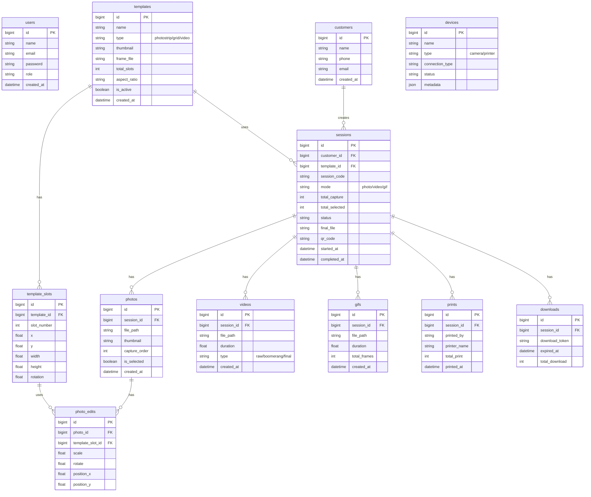

# Photobooth System

## 1. Entity Relationship Diagram (ERD)

## 2. System Flow

### FLOW VIDEO BOOTH
1. User pilih Video Booth
2. Countdown
3. Record 5-10 detik
4. Masuk table `videos`
5. Apply overlay/template
6. Generate final mp4
7. QR Download

### FLOW BOOMERANG
1. Record 2 detik
2. Forward
3. Reverse
4. Loop
5. Export mp4/gif

### FLOW GIF EXPORT
1. Capture multiple frame
2. Gabungkan
3. Generate GIF
4. Save table `gifs`

## 3. Tech Stack
- **Frontend**: Nuxt
- **Backend**: Laravel
- **Camera Service**: Node.js
- **Image Processing**: Sharp
- **Video Processing**: FFmpeg
- **Realtime**: Laravel Reverb
- **Database**: Mysql
- **Storage**: MinIO / S3
